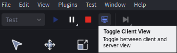

# Multi-Player Model: Server Client Model
- a central server maintains the game's state and syncs it with multiple player clients
- any Roblox game follows this model
- **SERVER:** handles critical game logic, physics, and data replication, ensuring all clients receive the same information and maintaining fair, secure gameplay
- **Client:** the player's machines that render the experience and run client-specific scripts, communicating with the server
- the server and client transmit data back and forth using scripts
- View a drawing of this [here](https://create.roblox.com/docs/projects/client-server)
 
## Server
- oversees the whole game, receives input from clients and distributes information back to them
- represents the central game logic and state that all players interact with
    - when something happens in the server, it will be replicated to be shown to every player in the server from their point of view
- **Server-Side Scripts (Server Scripts)** 
    - manage crucial game mechanics, data, and security, as they are not directly accessible or modifiable by individual players
    - transmits data from the server to all clients
    - camera is directed over the entire game, not one specific player
    - if we want to change something through a script, that is replicated(shown) for all players
    - manage game-winning conditions, player scores, or grant in-game currency because these actions must be controlled by the server to ensure fairness and security. 

## Clients
- Each player's device (PC, mobile, console) acts as a client, receiving data from the server to render the game and handle user input
- represents an individual player's instance of the game running on their device
    - they see every thing from their point of view
-  **Client-Side Scripts (Local Scripts)** 
    - handle player-specific interactions, UI elements, and visual effects that are only visible to that particular player
    - from the client to server
    - camera is directed towards the player
    - if we want to change something through a script, that is replicated(shown) for only one player
    - control visual effects on a player's screen, play sound effects, or manage UI elements like buttons, as these are specific to each player's view. 

## Client and Server View
- In Roblox Studio when you click `Test ➡️ Play` you will see the game frome the client/player perspective
- You can toggle between the client and server view
    - 

## Client and Server Scripts
- when we run a script on the client you will see the output in blue
- when we run a script on the server you will see the output in green

## Communication
**The server and clients communicate using RemoteEvents and RemoteFunctions.**
- **Remote Events:** Used for one-way data transfer, like sending a signal from the server to clients or vice versa.
    - clients do not have direct access to the information in the server, the client uses remote events
    to tell the server what it wants to do 
    - best to create remote events in the **`ReplicatedStorage Folder`**
- **Remote Functions:** Used for two-way, request-response interactions where the client sends a request and waits for a response from the server. 

## Data Model
**The server maintains the authoritative data model, which is then replicated to clients.**
- any changes made on the server are replicated to all connected clients, ensuring consistency

## Security
**By handling critical game logic on the server, Roblox prevents exploitation and hacking, as clients cannot directly alter game-critical data.**

____________________________________________________________________

### The client and server can only access folders that are explicitly designated as accessible to them.

####  Folders Accessible by the Server
- Server Scripts run on the game server can access and modify any part of the game. 
- **ServerScriptService:** contain server-side scripts and data that should not be tampered with
- **ServerStorage:**

#### Folders Accessible by the Client
- Client Scripts are limited to a read-only view of certain server-controlled folders and their own local data
- These are not folders within the Roblox Studio application's file system but rather are server-side folders replicated to the client to provide game functionality
- **ReplicatedStorage:** holds assets that are replicated from the server to all connected clients
    - things such as models, sounds, and images are placed in this folder so they are available to the client for display or interaction
- **StarterGui:** elements placed in this folder are copied to each player's PlayerGui folder when they join the game
    - GUI elements like buttons, health bars, or menus are placed in this folder allowing the client to display and interact with them. 
- **Workspace:** the client can see and interact with parts of the Workspace that are replicated to them by the server
- **PlayerGui:** each player has their own PlayerGui folder which is a local copy of the StarterGui 
- **ReplicatedFirst:** contents are replicated to the client before any other part of the game

## Remote Events
**There are three way of communicating from the server and client with Remote events**
1. From Client ➡️ Server
2. Server ➡️ Client
3. Server ➡️ To All Clients
**Learn more here ➡️ https://create.roblox.com/docs/scripting/events/remote#quick-reference