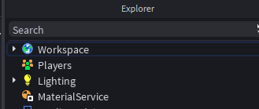
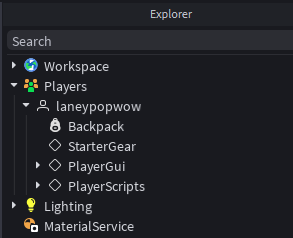
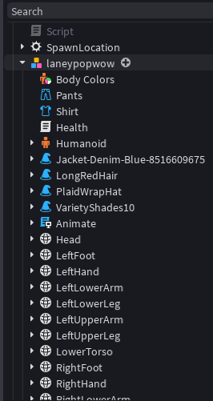

# Players Folder vs Player Object vs Player Character
- their ia a Players Folder, Player Object and Player Character, it is important tel know the difference between thses

# Players Folder
- Players, is an object that is a child of the game object
- In Explorer under the Workspace folder
- This folder is empty during developemnt, unless we add something to it

    
- When we click play to test the game, then all the **player objects** within the game are added to this folder

    

# Player Object(inside the players folder)
- **Contains four items:**
    - **Backpack:** items we have in the hotbar
    - **StarterGear:**
    - **PlayerGUI:**
    - **PlayerScripts:**
- We can add other things to this player object
    - [Leader Board](./LeaderBoard.md)

# Player Character
- located insided the workspace, during testing

    