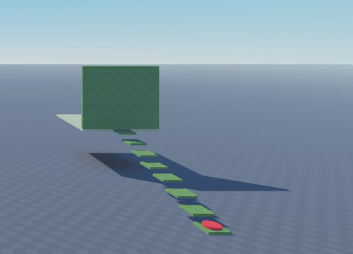

# Obstacle Course: Version 1
**When a player steps on a button the button will be pressed and the gate will open the player has 10 seconds to get through the gate before the gates closes. If the gate closes before the player gets through the player can got back and pressed the button again to try again**

## Components
- Main Components have been created for Stage 1

    

## Functionality
- When a player steps on the button the button will start a 10 second timer
- After 10 seconds the button will unpress and player can press the button again and start the timer over
- see the code [here](./MainScript.lua)
