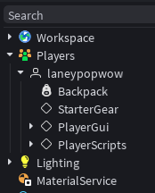
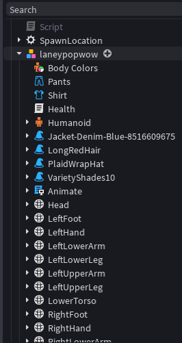
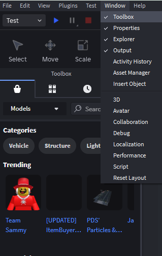
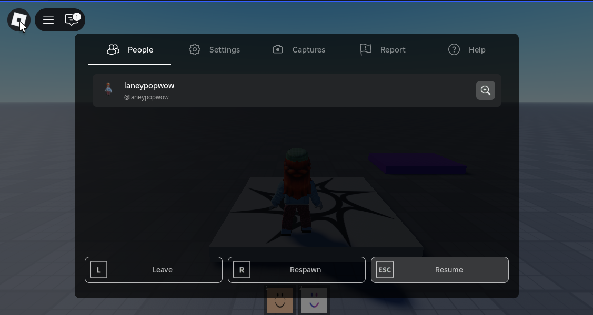

# 🛠️ Tools
- items for players to use from their backpack or inventory 
- like weapons or tools or anything equipable that players can use to further progress through the game

## 🤹🏾‍♀️ Player Instance vs Player Character
**When a player joins the game two things are added for the player**

1. **Player Instance:** is added inside the Players folder, this is they player object that all player get
    - 
2. **Player Character:** is added to the workspace, this is the clone/copy of the player character
    - this is what we see in the game
    - contains the stuff that creates the character
    - 

## 🎒 Create a Tool: Starter Pack
- tools are created in the **StarterPack** folder inside the game
    - default backpack for all players
    - will be added to all players backpack no matter what, when they join the game for the first time or if they reset their character
- click the `+` sign next to **`StarterPack`** and select **`Tool`**
    - just a empty tool instance
    - with the name of the tool on it
- run the game and you will see the tool on the screen
- look in the **Player Instance** back and you will see the tool there also

### ✏️ Add Tool Tip-Property
- text that displays when you hover over the tool, giving you some information about it
- add some text to the `toolTip` property
- test and run the game and you should see it displayed when you hover over the tool

### 🖼️ TextureId
- to show an image for the tool
- you can use the toolbox to add image, not recommended because creators of these images can use them to hack your game, but you can use it for demonstration purposes, select one that does not have scripts
    - 
- from the toolbox drop down menu select decals find a image and right click it then select `Copy asset ID`
- paste it in the `TextureId` property of the tool
- test and run the game and you should see it displayed on the tool instaed of the name of the tool

### 🫸🏾 Create A Handle
- to show that the player is holding something when they equip a tool 
- add a part to the workspace
- make sure that anchored is not checked in the part properties
    - all parts of a tool, including the `Handle`, must be unanchored for the tool to function properly when equipped
- Name the part `Handle` and add it to the tool
    - the part named `Handle` is required for a Tool object to function correctly
    - tells roblox that this is a part that we want to display on the player hand when the tool is equipped
    - `Handle` acts as the primary point of attachment when a player equips the tool and is held in their character's hand
    - allows the tool to weld to the player's character, typically the right arm, enabling proper - if a tool is missing a part named `Handle`, the player will drop the tool instead of holding it, or it may not appear in their hand at all
- test and run the game, click the tool to euip and uneuip it and you should see the part in the players hand
- when the tool is equipped the tool is removed from the backpack in the player instance and added to our player character
- when the tool is unequipped the tool is removed from our player character and added back to the backpack in the player instance 
- **Drop the Part:** on a computer you can use `baskspace` to drop the part
    - when the part is dropped the tool is added to the workspace
    - walk to the tool to pick it back up and it will be added back to the player character
    - you can set the `CanBeDropped` property of the Tool to false(unchecked) if you dont want it to be able to be dropped
    - Scale property of the tool can change its size

### 😶 Tool without a handle
- the player can equip this tool and no physical object will show
- uncheck the `RequiresHandle` Property of the tool

### 🎬 Activating the tool
- we can use a script to handle what happens when a tool is activated and deactivated
- we can check the `ManualActivationOnly` Property of the tool
    - the user will not be able to activated the tool by clicking or tapping etc...
    - activation will happen only through scripts

### 📜 Script Tool
- use local scripts
- [Script Example](../../WorkingWithScripts/events/toolevents.lua)
<!-- - demostartion uses a regular script right now I will change later -->

## ⚙️ Create a Tool: Starter Gear
- like the starter pack but the tools specific to a particular player or team
- add the tool to the `ReplicatedStorage` folder
- test and run the game, you will not see the tool on the screen, but it will be in the `ReplicatedStorage` folder
- switch to server view
    - drag the tool from the `ReplicatedStorage` folder to the `StarterGear` folder of the player instance
    - switch back to the client view and reset the character
        - click `Respawn` then `Reset`
            - 
            - after the character is reset the player will spawn in with the tool
            - since the tool was specifically put inside the `StarterGear` folder, the player will start with the tools in the `StarterPack` and `StarterGear` folders
    - if you go back into the server and delete the tool from the `StarterGear` folder
    - then go back to the client and reset the player, it will no longer spawn in with the tool
- you can do this with a script by setting the parent of the tool to the backpack and to the starter gear so when the player spawns in they will have the tool