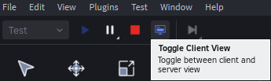

# Multi-Player Model: Server Client Model
- any Roblox game follows this model
- **SERVER:** reserved section of a game that oversees the whole game
- **Client:** is like each individual player and they each connect to the client
- View a drawing of this [here](https://create.roblox.com/docs/projects/client-server)
 
## Server
- represents the central game logic and state that all players interact with
- changes made on the server are visible to all connected clients
- Server-side scripts (Server Scripts) manage crucial game mechanics, data, and security, as they are not directly accessible or modifiable by individual players
- camera is directed over the entire game, not one specific player
- controls everything that happens with the game
- controls synchronization among all players of the game
- **replcation:** when something happens in the server, it will be replicated to be shown to every player in the server from their point of view
- **transmitting data:**
    - **Server Scripts:** from the server to all clients
        - if we want to change something through a script, that is replicated(shown) for all players
    - **Local Scripts:** from the server to one client
        - if we want to change something through a script, that is replicated(shown) for only one player
    - from one client(player) to the server

## Clients
- represents an individual player's instance of the game running on their device
-  Client-side scripts (Local Scripts) handle player-specific interactions, UI elements, and visual effects that are only visible to that particular player
- camera is directed towards the player
- they see every thing from their point of view

## Client and Server View
- In Roblox Studio when you click `Test ➡️ Play` you will see the game frome the client/player perspective
- You can toggle between the client and server view

    - 

## Client and Server Scripts
- when we run a script on the client you will see the output in blue
- when we run a script on the server you will see the output in green

