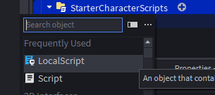
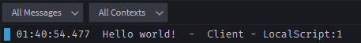

# 📜 LocalScripts
- for player-specific actions visible only to that client
- from the server to one client
- if we want to change something through a script, that is replicated(shown) for only one player
- run on a player's client, affecting only that specific user and used for UI or player-specific features


## Create a Local Script
- Add a local script
    - 
- this will bring up the script editor where we will write our script
- when we run a script on the client you will see the output in blue
    - 

- Add a part to the baseplate and use the properties window to give it a differnt color
- write a script to make the color change when a player steps on it 

    ```lua
    local part = game.Workspace:WaitForChild("Part")
    part.Touched:Connect(function() 
        part.BrickColor = BrickColor.new("Hot pink")
    end)
    ```
- click play and use the player to step on the part
- the color will change to Hot pink
- if you toggle to the server view you will see that the color has not changed