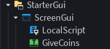
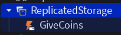
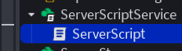

# Give Currency: Communicate Between Server and Client
**When the button is clicked it will add coins to the players coins stats**
## Purpose: Comunication from the Client to the server
- You cannot directly change the server's game state from a client-side LocalScript due to security measures like Filtering Enabled
    - like changing a part's color to make it visible to everyone, or to updating the coins of a player
    - you can change a parts color or update coins on the client but that change will only happen for the current player
- The client needs to tell the server to make changes that are then synchronized for all players
**This project demonstrates how to allow a player to press a button and update their coins value and ensuring the change is seen by everyone**

### Features
#### ServerScripts
- RemoteEvent Object
- `OnServerEvent` event

#### LocalScript
- ScreenGUI Object
- RemoteEvent Object
    - `FireServer()` method on the RemoteEvent object
- TextButton Object

### Process
1. A player presses a TextButton `GiveCoins` to get coins
2. The `LocalScript` listens for the button click
    

3. When clicked, the `MouseButton1Click` event triggers the remote events`GiveCoins:FireServer()`
    

4. The `FireServer()` function in the local script automatically passes the signal and the data to the `OnServerEvent` located in the serverscript
    - the `OnServerEvent` is also connected to the same remote event, `GiveCoins`, so it receives the signal and the data
    
5. The server then adds the coins to the player's account and updates their coins, ensuring the change is seen by everyone
