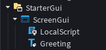

# Send Message To Player: Communicate Between Server and Client
**When a player joins a game we can tell the server to send a message to the client**
## Purpose: Comunication from the Server to the Client
- communicating from the server to the client
**This project demonstrates how to tell the server to send a message to the client**

### Features
- [RemoteEvent: Server ➡️ Client](https://create.roblox.com/docs/scripting/events/remote#client-server)

### Process
1. A player joins the game
2. On the server the RemoteEvent `GreetPlayer` triggers the `FireClient()`function
    
    

3. The `OnClientEvent` connected to the `GreetPlayer` RemoteEvent is triggered on the client
        
    

4. The message is sent to player using the `Greeting` TextLabel
    
    
