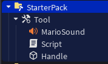

# Tool Clicks
### Functionality
1. When tool is equipped a sound plays
2. When tool is activated it 
    - scales up to 2 
    - changes to a random color every 0.5 seconds
    - adds 1 to the leaderstat Clicked
3. When tool is deactivated it scales back down to 1

### Demonstrates
- 

### How to Duplicate
##### Step Up Tool
1. Create a Tool in the `StarterPack` Folder
2. Add a `Part` to the Tool, the tool must be named `Handle`
3. Select a Sound from the toolbox and Insert it in the Tool
    - Select the tool and click the `Insert` button on the sound
    - Give your sound a name
4. Add a script to the tool
    - code from [`toolScript.lua`](./toolScript.lua) goes in this script file
    - read the comments and change the code where needed to fit your game
- The StarterPack folder should now look like this
    

#### Create Leaderstats
1. Add a script inside the `ServerScriptService` folder
    - code from [`leaderstatsScript.lua`](./leaderstatsScript.lua) goes in this script file

**Test and run the game**